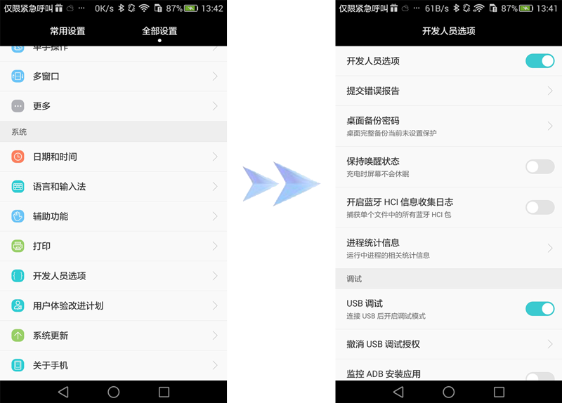
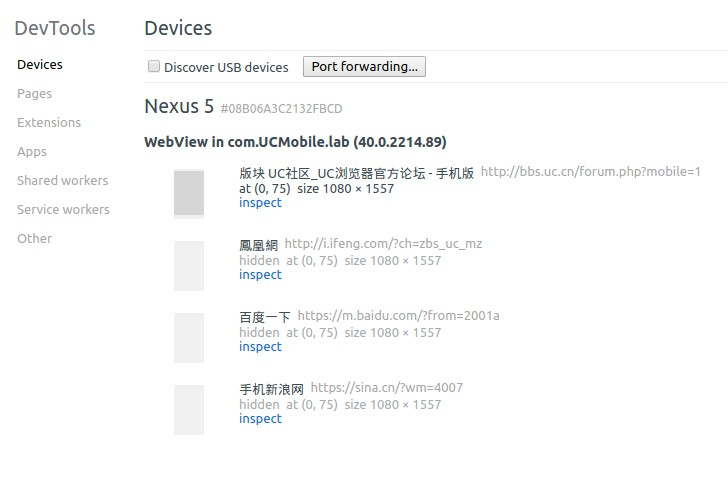

# UC browser developer version (Android platform)
An English translation of the UC Browser instructions for setting up dev tools. Translation done by Google Translate

## CONTENTS
* 1 About UC DEV TOOLS
* 2 Preparations
* 2.1 mobile phone side
* 2.2 PC side
* 2.3 Connecting the phone to the PC
* 2.3.1 ADB environment settings on Windows
* 2.3.2 ADB environment settings on MAC
* 3 Debugging Method
* 4 debug panel
* 4.1 Elements Panel
* 4.1.1 highlighting page elements
* 4.1.2 Checking the HTML code of the selected element
* 4.1.3 modify the original page of the HTML code
* 4.2 Resource Panel
* 4.3 Network Panel
* 4.4 Sources Panel
* 4.5 Console (Console)
* 5 special instructions
* 5.1 Unsupported Features
* 5.2 Other Precautions


## 1 - About UC DevTools
In order to help developers more easily develop and debug UC browser-based pages, we launched UC browser Developer version (Android platform). The developer version of the debugging method and Chrome DevTools basically the same, Using the developer version, you can:

* View and modify DOM elements
* Debug JavaScript and CSS
* Check the network status
* View the resource file
* View Console Console output
* Track memory leaks


## 2 - Ready to work

### 2.1 - Mobile terminal 

Enter the official website of UC Developer Center (website address), download UC browser development platform for Android Person version (UCBrowser_DevTools.apk, Download) mounted to the phone. Before commissioning, open USB debugging (Settings - Developer Options - USB Debug) on ??the phone side.




### 2.2 - PC side 
PC machine, and install Chrome on a PC, supports Chrome 40 version (__does not support FireFox Safari and other browsers__).

Download adb tool (adb_tool.zip, Download) to your PC. 

### 2.3 Connect your phone to PC

Android platform UC browser developer version, remote debugging currently only supports USB connection. USB connection mode Need to build Android SDK development environment on the PC or install adb tools.


### 2.3.1 - ADB environment settings on Windows
To ensure that Windows computers have Android SDK development environment or installed adb tools, if no, can participate Check the following adb tools.

With the Windows operating system adb installation reference 

 1. on the PC, through the network to download and install pea pods (or other Android phone assistant);

 0. Open the USB debug mode on the phone: Settings > Developer Options> USB Debugging
 
 0. connected to the phone and PC, if the PC without mobile phone, pea pod will automatically download and install; 
 
 0. the phone and PC connected to the pea pod can be identified as a normal connection 
 
 0. extract the adb_tool.zip to the `C:\WINDOWS\system32` directory 

 0. Start > Run > enter cmd.exe into the Windows command prompt window, enter adb, if no error And can see the `Android Debug Bridge version 1.0.31` prompt, it means adb Successful installation 

### 2.3.2 - MAC ADB environment settings on MAC
UC browser developer version is suitable for the development environment is the MAC machine, the same, also need to have MAC machine Android SDK development environment or the installation of adb tools, if not, you can refer to the following installation adb tools. 

adb installation reference on MAC machine operating system (Mac OS X 10.7.4 and above). 

1. Download Android sdk for mac
    
    Open the safari browser, enter the URL: Http://developer.android.com/sdk/index.html The displayed page is probably as follows:  
    

0. Click the "Download the SDK" link to start and download the android-adk development package. 

    In this example, I downloaded the installation package is: `adt-bundle-mac-x86_64.zip`. Safari automatically decompression after the directory is `adt-bundle-mac-x86_64-20130522/` The full catalog on mac is: `/Users/huangmy/Downloads/dt-bundle-mac-x86_64-20130522/`  
    
    _Note: This is the author of the mac machine directory structure, the reader should pay attention to replace their own mac machine directory the following If the description of the directory, no special instructions, are the author of the mac machine directory structure, the reader should pay attention to Replace it with your own mac machine directory._
    
    For easy management, move the android-adk directory from the download directory to the android work directory. First created Android work directory, then move the directory. The specific operation is as follows: 
    
    Open a command line window (terminal) and enter the following command:  

    ```shell
    mkdir /Users/huangmy/android
    cd /Users/huangmy/Downloads/
    mv adt-bundle-mac-x86_64-20130522/ ../android/
    ```

0. Configure environment variables
    
    Open a command line window (terminal), edit the current user's configuration file (.bash_profile), enter the following command:
    
    ```shell
    vim ~ / .bash_profile
    ```
    (Note: I use the VIM text tool, the reader also use this tool (need to install the tool VIM), you can also use the other Text editing tools)
    
    At the end of the file, enter the following line: 
    
    ```shell
    ANDROID_SDK_PATH=/Users/huangmy/android/adt-bundle-mac-x86_64-20130522/sdk
    export ANDROID_SDK_PATH
    export PATH=$PATH:$ANDROID_SDK_PATH/platform-tools:$ ANDROID_SDK_PATH/tools
    ```
    Screenshots are as follows: Enter the end, save and exit VIM.
    
    

    Make the configuration file take effect immediately, enter the command: 

    ```shell
    source ~/.bash_profile
    ```
    Check android adb tool is valid, you can enter the command: Adb version After the carriage return, if you see the adb version of the information, then adb tool is now available. As shown below: Note: different adb version, adb version may not be the same example, the author is installed on the ad machine adb version number.
    
    


## 3 Debug mode
Start the UC browser developer on your phone and open the page you want to debug. Open Chrome on your PC, click "Tools - Check Device" or enter in the address bar: `chrome://inspect`, to see UC Browser 



Dev opened index page: Next, click on any need to debug the page can be debugged, debugging methods and PC development on the Chrome Tools are similar to debugging methods. To UC community site, for example, click "inspect" to enter the debugging page:


In particular, unlike a previous developer version, a new developer version of a page is debugged when the system The title bar does not prompt the debug mode to be turned on. All work is ready and the next step is in the commissioning phase.


## 4 - Debug panel
This is the UC browser developer version of the debugging function panel (with Chrome basically the same). This section is below Introducing element panels, resource panels, web panels, script panels, and consoles. 

_Note: If Chrome is installed on the Chrome Adblock Plus extension, then the UC browser development version Adblock Plus panels will also appear in this debug panel._

Before introducing each panel, first introduce a useful function, click on the upper right corner , You can hand  The machine side page is mapped to the PC at the same time become , The effect shown in Figure:


Click on the top right corner , And become a normal mode, the effect is as follows:


### 4.1 - Elements Panel

In the Elements panel, you can see the DOM tree structure of the entire page and the Have attributes. You can modify these elements on the PC and its properties, and real-time on the phone to see the modified effect.


### 4.1.1 - Highlight page elements
In the debug page, the mouse to move to the page menu corresponding to the HTML code, as shown below:


The corresponding DOM element on the corresponding page on the corresponding phone will be highlighted in the UC browser developer version Bright as shown below:


### 4.1.2 - View the HTML code for the selected element
On the left side of Elements, there is a magnifying glass button , Click the button to make the magnifying glass into blue 
, The Inspect feature is turned on. 


After the magnifying glass turns blue, click the "Forum" link on the debug page of the UC Browser Developer Edition, as follows Figure:


The corresponding page in the PC side of the browser debugging page will highlight the "Forum" link corresponding HTML code, with Set the magnifying glass to the default state ,As shown below:


To turn on Inspect again, you need to click the magnifying glass button again to make it blue. 


### 4.1.3 - Modify the HTML code of the original page
In the PC side of the browser debugging page, modify the "Forum" to "BBS", as shown in Figure:


The corresponding mobile phone side of the page structure of the page will also be changed, as shown below:


### 4.2 - Source Panel
In the resources panel, you can see the phone side of the debugging page from the network to download all the resources, you can also view Cooked pages of cookies and storage information.


### 4.3 - Network Panel
In the network panel, you can see the resource URL to load the situation, including the request header, the contents of the request text And the time required to load. 


Click on the network panel, do not see any resources to load, refresh the page on the phone, you can see the resources URL loading situation.


Click on any resource, such as "2.jpg", you can see the specific circumstances of the resource request.


### 4.4 - The Sources Panel
Script panel can view all the resources of the page (html, js, css, pictures, etc.), the more important function is You can set breakpoint debugging Javascript scripts.


Click on the bottom of the , You can format the code.


Click on the number of lines of Javascript code, then set the breakpoint, refresh the debug page on the phone side, then trigger Breakpoint, after which you can debug. 


### 4.5 - Console (Console)
In the Console panel, you can view page error messages, enter commands to perform the required actions (such as viewing properties Value, execute Javascript, etc.).


_* Note: For more debugging method, refer to the Google Developer Center (website address)._


## 5 - Special Instructions

### 5.1 - Unsupported features
Due to compatibility issues such as version compatibility, developers do not currently support the current features are:

* Remove the listening event in Elements's Event Listeners

### 5.2 - Other precautions
Use the developer version Other things to note are:

* Visit page A on the developer version and get debug on Chrome; then visit page B, Re-click "inspect" on Chrome to go to page B debugging.

* After entering the debugging of page A and then enter the debugging of page B, the debugging page A enters the "inactive" state, Test page B into the "active" state.

* If multiple windows are opened on the developer version, only the current window page is in the "active" state, the other The window page is "inactive".


Beijing company  
Switchboard: 010-59610022  
Fax: 010-59610021  
Address: 16 / F, Vivia Building, No.29 Suzhou Street, Haidian District, Beijing  
Zip code: 100080

Guangzhou company  
Tel: 020-66824888  
Fax: 020-66824881  
Address: Tianhe District, Guangzhou City, Huangpu Road, West Pingyun Road 163, Guangyun Square B tower  
Zip code: 510665

Wuhan company  
Switchboard: 027-59715104  
Fax: 027-87804105  
Address: 15 / F, Building 1, SBI Venture Street, East Lake Development Zone, Wuhan City  
Post Code: 430073 Http://www.uc.cn
